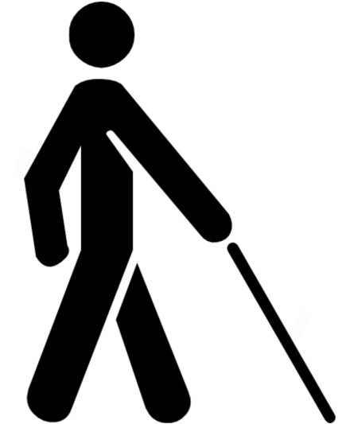

 
 
# RAAHI

## Navigation for the Visually Impaired
How does a visually impaired person find his or her way around anywhere? Can computer vision help in that , atleast to some extent?
### Objective
To make a computer vision model which detects the lanes, objects and obstacles in a person's path and provides 
information for his or her navigation. 

### Tasks
<ul><li> To make a lane detector which identifies walkable lanes and produce an output on the fly.</li>
    <li> To produce an object detection model which identifies potential obstacles in the path of 
      an impaired person.</li>
</ul>

### What we did 
 - Used openCV for producing a lane detector. Inherent techniques used were Canny detection and Polynomial Regression
 - Used the standard YOLO algorithm for the implementation of the object detectors.
 
# PROCESS
 
## Lane Detection - openCV
 - The openCV library of python was used to detect the lanes in the frames of our dataset.
 - The hierarchy algorithms used were - 
    - Grayscaling for elimination of RGB channels.
    - Gaussian Blurring for removing noise
    - Canny Edge Detection and Image segmentation
    - **Further Noise removal through thresholding over segmented parts of image**
    - **Point aggregation and Polynomial fitting over the detected points**
 ### OLD APPROACH
 - The final lines resulting from Hough Transform were overlayed on the frames to produce final output.
 - <b>Final Output on Dataset</b> 
  
 
 ### NEW APPROACH ✨
 > Segmentation
 - The Hough Transform approach to fit the lanes posed a serious limitation that it was only able to detect straight lines or sharp edges present in the image.
 - Using the modified approach for lane detection, we analysed images by **dividing the whole image into segments**. This segmentation helped us to *further* reduce the noise present in our frames by - 
    - Setting off those pixel values to 0 which had a very high density or a very low density in a particular segment. This was based on the assumption that any kind of noise in an image would either be an aggregation of a lot of points or very few points
    - Leaving the Canny detected points as it is when there was relatively moderate density.
    ## Image before segmentation noise removal 
    
    ## Image after segmentation noise removal
    
> Polynomial Fitting
- Regression techniques are used to fit the best curve to a given set of points. Since Canny edge detector returns *precisely* that, we tried fitting **second degree polynomials** to the detected images
- Since the curvature of the points only depends on the lane points and this curvature can be arbitrary, the **limitation of Hough Transform was overcome**
     ### Final Curves detected
     // to do...

## Predictions for Lanes 
- A predictor was built according to the curves that were detected and *audio outputs* were provided to the user according to the type of lane approaching.
- The basis for the predictions was the amount of lane points present on the left and right of the frame middle and **mean** and **median** basis was used to detect the lane center.
- A particular threshold was provided which identified how much *shift* from the lane center is considered as *good lane maintenance* and other outputs included *shift left, shift right, right turn and left turn detections*

## Lane Detection - CNN and YOLO Object Detection
 > Contributed by [Aditya Karn](https://github.com/AdityaKarn)
 - A standard implementation of deep neural networks was used to overcome the shortcomings of the Lane Detection through openCV. Some of them 
  were <b>not being able to detect the curvature of the path of a lane</b> and <b>shifting of lines regarding to the noise present in the image
  such as gravel on road or patterns in a sidewalk</b>
## Lane Detection - CNN
 - Since this was not a straightforward classification or regression problem, we had to first identify what to predict with CNN. 
 - With CNN, we predicted 12 things. What were they? We assumed a lane to be majorly composed of six <b>anchor points</b> and tried to predict the x and y
   co-ordinates of anchor points of the left and the right lanes through CNN.
 - OUR DATASET LABELLER 
  
 - We used a standard implementation of a CNN for the predictions which turned out to be better than expected, given that the dataset was limited 
   and the number of epochs were limited to 40 to avoid overfitting.
 - OUR RESULTS 
   
## Object Detection - YOLO Algorithm
- The task of <b>Object Detection</b> in video frames was implemented using the YOLO algorithm on pretrained weights.
- We detetected numerous classes of objects that were termed as obstacles for the 
visually impaired and produced an output on the fly. The neural net model used for the predictions was <b>Darknet-53</b>
- It can be clearly seen that the results obtained on the frames were quite clear and the accuracy was very high.
- OUR RESULTS 
  
> Implementation details available [here](https://github.com/AdityaKarn/innerve-hackathon#how-to-run)

## Where to go from here?
- Our project currently comprises of three different models that are used for lane detection and object detection separately. We intend
 to combine all our models and make a final overlayed frame that is capable of detection of lanes as well as objects.
- Another aspect of our project that needs to be looked over is deployment. We intend to deploy our project through the upcoming 
  Tensorflow lite for mobile applications and hope to make this into a small application that can be personalized according to the user.
- Last but not the least, linking GPS functionality to our project is the one thing that would enable us to give directions for not only
 safe navigation but also ensure the user can reach his or her destination independently with little or no help.
 
